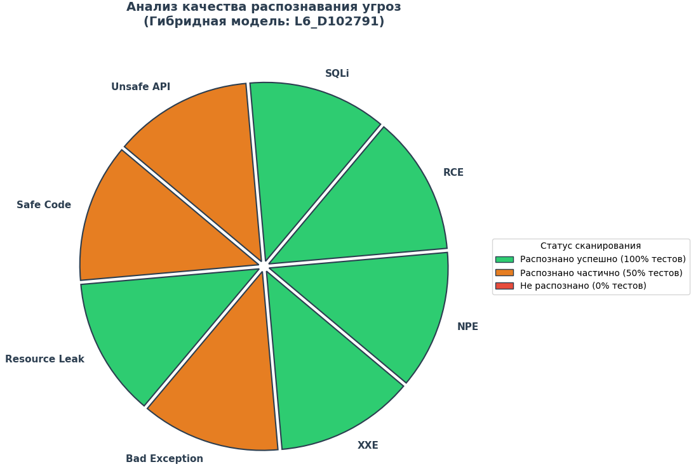

# Transformer

# Hybrid-SAST: Neuro-Symbolic Vulnerability Detection Transformer

Гибридный анализатор исходного кода на основе трансформерной модели (из статьи "Attention is All you need" 2017 года), интегрируемый в среду разработки IntelliJ IDEA. Проект объединяет семантическую обобщающую способность нейросетевых моделей класса Transformer и узконаправленные правила статического анализатора SonarQube для выявления 7 критических уязвимостей на ранних этапах жизненного цикла разработки ПО.

---

## 1. Цели проекта и решаемая бизнес-задача

### Бизнес-задача: Сдвиг безопасности «влево» (Shift-Left Security)
Традиционные инструменты статического анализа (SAST) запускаются на этапе сборки в CI/CD, и обнаружение уязвимости на этих этапах существенно задерживает релиз и увеличивает стоимость исправления дефекта безопасности в десятки раз.

**Цель проекта** — предложение разработчику альтернативы стандартному статическому анализу кода на этапе выполнения пайплайна, заменив его легкой проверкой на основные типы уязвимостей через реализацию трансформерной модели - распознавание конкретных паттернов уязвимостей на 1-2 уровне вложенности вызовов методов. В дальнейшем, после исправления модуля парсера и написание генератора функций, планируется внедрение проекта как плагина в IntellijIDEA.

### Ключевые преимущества подхода:
1.  Модель анализирует локальную структуру метода, импорты и поля класса (в рамках только одного файла). В данном случае это ведёт к ускорению анализа и избавляет от необходимости построения глобального графа межпроцедурных вызовов (Call Graph) всего проекта. Большинство логики сейчас организуется в одном классе (сервисы и контроллеры в основном, поэтому такой подход считаю допустимым).
2. Благодаря легковесному С++ бэкенду библиотеки ND4J, инференс модели выполняется локально на CPU разработчика, наличие видеокарты не обязательно, разница по времени обучения между "Ryzen 9 7900X" и "RTX 5070 Ti" в 3 раза. Обучение длится в течение часа (но и без обучения модель уже обучена на 112000 функциях, параметры обучения в файлах transformer_model.ser и vocabulary.ser)

---

## 2. Архитектура системы классификации

Модель классифицирует исследуемые методы на 8 классов согласно международной классификации слабых мест безопасности (CWE):

| Класс | Имя класса | Категория CWE | Описание |
| :---: | :--- | :--- | :--- |
| **0** | **Safe Code** | - | Безопасный код, прошедший валидацию, или тестовые методы. |
| **1** | **Resource Leak** | CWE-404, CWE-772 | Утечки ресурсов (незакрытые потоки ввода-вывода, сокеты, соединения БД). |
| **2** | **Bad Exception** | CWE-248, CWE-460 | Ошибки обработки исключений, пустые catch-блоки, забытые stubs-заглушки. |
| **3** | **XXE** | CWE-611, CWE-827 | Небезопасная конфигурация XML-парсеров (внедрение внешних сущностей). |
| **4** | **NPE** | CWE-476 | Риск разыменования нулевого указателя (Null Pointer Exception). |
| **5** | **RCE** | CWE-78, CWE-94 | Удаленное выполнение команд ОС через небезопасный системный вызов. |
| **6** | **SQLi** | CWE-89, CWE-90 | Внедрение SQL-кода через сырую конкатенацию пользовательского ввода. |
| **7** | **Unsafe API** | CWE-502, CWE-676 | Небезопасная десериализация объектов или использование опасного Java API. |

---

## 3. Инструкция по запуску в Java

Для запуска модели перейдите в src/main/java/org/example/Predict.java и запустите предикт, код можно изменять внутри классов, максимальная длина - 512 слов.
Если код длинный и содержит несколько уязвимостей, внутри парсера при построении AST-дерева код разбивается на форматы: "класс-функция" с отношением 1:1. 
На ответ выдается самая опасная уязвимость, описанная в приоритетах в Predict.java в функции applyHeuristics в 62 строке.

### Шаг 1. Экспорт весов на стороне Python
После завершения обучения (или при наличии предобученных весов `best_code_transformer.pth` и словаря `vocab.pkl`) запустите скрипт конвертации:

python export_after_training.py

Скрипт создаст в корне проекта папку `exported_model`, содержащую веса слоев в формате `.npy` и преобразованный словарь `vocab.json`.

### Шаг 2. Копирование весов в Java-проект
Перенесите полученную папку `exported_model` целиком в корневую директорию вашего Java-проекта в IntelliJ IDEA (на одном уровне с папкой `src`).

### Шаг 3. Запуск процесса миграции весов
Запустите класс миграции `MigrateApp.java` (пакет `org.example.migration`) внутри IntelliJ IDEA:
1. Откройте файл `MigrateApp.java`.
2. Нажмите зеленую кнопку **Run 'MigrateApp.main()'** на панели инструментов или слева от объявления класса.

Программа прочитает JSON-словарь, инициализирует пустую структуру `TransformerModel` на 6 слоев и 8 голов, заполнит её весами и сериализует в бинарные файлы в корне проекта:
* `transformer_model.ser` — сериализованные веса и структура сети.
* `vocabulary.ser` — сериализованный словарь токенов.

### Шаг 4. Анализ уязвимостей (Запуск инференса)
Для проверки кода на наличие уязвимостей:
1. Запишите проверяемый Java-код в файл `input_code.txt` в корне проекта (или выберите режим генерации шаблона).
2. Запустите исполняемый класс `Predict.java` в IntelliJ IDEA.
3. Выберите режим работы:
   * **1** — для анализа вашего текущего кода в `input_code.txt`.
   * **2** — для генерации одного из встроенных реалистичных сценариев (Spring Boot REST-контроллеры, уязвимости в JDBC, XXE-конфигурациях и др.).

Вы получите семантический вердикт модели с выводом оценки уверенности и применением эвристического предохранителя в случае слабой уверенности нейросети (это временное решение, уже исправлено, но требуется переобучение модели, так как сейчас
датасет составлен путем голосования между 7 головами для каждой ошибки и функциями SonarQube для внедрения части статического анализ).

## 5. Оценка распознающей способности модели

Результаты тестирования гибридного ядра на 16 экспертных сценариях (по 2 на каждый тип угроз) представлены в виде распределения весов:
* **Иерархия уязвимостей:** При обнаружении нескольких пересекающихся сигнатур (например, риск NPE в SQL-запросе) система приоритетно классифицирует метод по наиболее критическому вектору атаки:
  `RCE (5) > SQLi (6) > XXE (3) > Unsafe API (7) > Resource Leak (1) > NPE (4) > Bad Exception (2)`.
* **Эвристический корректор:** В случае пограничной уверенности нейросети (ниже 45%) эвристический модуль выполняет быстрый статический анализ по ключевым словам AST-дерева и корректирует итоговый класс.

* **Визуализация распознающей способности гибридной модели**:

Как видно из рисунка, из 16 примеров кода, который уже реально применим в backend-разработке, модель распознала корректно 13/16 паттернов уязвимостей. 

### Вот подробная таблица ответов модели:
| Ожидаемый класс | Ответ модели (Вердикт) | Уверенность |  Статус  |
| :--- | :--- | :---: |:--------:|
| **Safe Code** | NPE | 83.48% |  Ошибка  |
| **Safe Code** | Safe Code | 98.76% | Успешно  |
| **Resource Leak** | Resource Leak | 99.70% | Успешно  |
| **Resource Leak** | Resource Leak | 99.86% | Успешно  |
| **Bad Exception** | Bad Exception | 99.97% | Успешно  |
| **Bad Exception** | NPE | 99.79% |  Ошибка  |
| **XXE** | XXE | 99.80% | Успешно  |
| **XXE** | XXE | 99.78% | Успешно  |
| **NPE** | NPE | 98.48% | Успешно  |
| **NPE** | NPE | 99.77% | Успешно  |
| **RCE** | RCE | 99.77% | Успешно  |
| **RCE** | RCE | 93.02% | Успешно  |
| **SQLi** | SQLi | 95.53% | Успешно  |
| **SQLi** | SQLi | 99.65% | Успешно  |
| **Unsafe API** | RCE | 99.75% |  Ошибка  |
| **Unsafe API** | Unsafe API | 99.98% | Успешно  |

> **Примечание:** В связи с тем, что уверенность нейросети во всех тестах превысила порог в **45%**, корректировка эвристиками не потребовалась.

